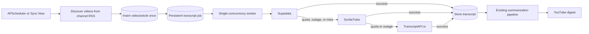

# Async YouTube Transcript Pipeline

**Date:** 2026-06-27  
**Status:** Proposed — not implemented  
**Requirement:** Product Management Specification, section 2.2  
**Target volume:** 50–100 newly discovered YouTube videos per month  
**Cost constraint:** No paid transcript extraction

---

## 1. Executive Summary

YouTube discovery and summarization are already implemented, but transcript extraction succeeds locally and fails on the VPS. The failure is not caused by FastAPI, Docker, or a lack of asynchronous code. `youtube-transcript-api` documents that YouTube commonly blocks IP addresses belonging to cloud providers, which matches the `IpBlocked`/`RequestBlocked` errors observed on the VPS.

The proposed solution has two independent parts:

1. **Change transcript egress:** use legitimate transcript API free tiers instead of requesting captions directly from the blocked VPS address.
2. **Make processing durable and asynchronous:** split video discovery from transcript retrieval, persist work in SQLite, and process it with a dedicated worker.

The default provider order will be:

1. **Supadata** — primary provider.
2. **ScribeTube** — first fallback.
3. **TranscriptAPI.io** — second fallback.
4. **Direct `youtube-transcript-api`** — optional local-development provider only.

This design keeps the daily scheduler and data on the VPS, survives application restarts, avoids paid AI transcription, and is not tied to a single transcript vendor.

> **Decision:** Implement a configurable provider chain backed by a persistent SQLite job queue and a separate single-concurrency worker.

---

## 2. Current State and Root Cause

### Current pipeline

The application currently:

- discovers recent videos through YouTube channel RSS feeds;
- invokes `youtube-transcript-api` directly from `app/scraper/youtube/service.py`;
- pauses synchronously between transcript and channel requests;
- runs scheduled work through an in-process APScheduler job;
- launches manual work in a daemon thread;
- stores job progress only in process memory;
- stores the video snippet as `raw_text` when no transcript is available.

### Why it fails on the VPS

The transcript library sends requests from the machine on which it runs. Locally, those requests use a residential ISP address. On the VPS, they use a datacenter address that YouTube may block regardless of the low request volume.

Adding `asyncio`, more threads, a task queue, longer delays, or a different scheduler will not change the public source IP. Increasing concurrency may make rate limiting worse.

Reference: [`youtube-transcript-api` — working around IP bans](https://github.com/jdepoix/youtube-transcript-api#working-around-ip-bans-requestblocked-or-ipblocked-exception)

### Reliability problems unrelated to IP blocking

The current background mechanism also has operational weaknesses:

- daemon threads disappear when the web process restarts;
- in-memory progress is lost during deployment or failure;
- there is no durable retry schedule;
- web and scheduled runs can overlap;
- `uvicorn --reload` is enabled in the production container;
- a missing transcript can be summarized from its description as if it were a transcript.

These problems justify an asynchronous worker, but the worker must use different transcript egress to solve the VPS block.

---

## 3. Options Considered

| Option | Free | VPS-compatible | Reliability | Decision |
|---|---:|---:|---:|---|
| Direct `youtube-transcript-api` with delays | Yes | No, when VPS IP is blocked | Low | Keep for local development only |
| More threads or `asyncio` | Yes | No change to VPS IP | Low | Reject as a network fix |
| Official YouTube Data API captions endpoint | Yes quota | Not for arbitrary followed creators | High within its scope | Reject for transcript retrieval |
| Residential proxy provider | Usually no | Yes | High with rotation | Reject under the free-only constraint |
| Home device or residential exit node | No incremental fee | Yes | Good if always online | Unavailable: no suitable device exists |
| GitHub Actions or another free cloud runner | Usually | Still uses datacenter egress | Uncertain | Reject as primary solution |
| Cloudflare Worker as a proxy | Has free tier | Still shared/cloud egress | Uncertain | Reject as primary solution |
| Free transcript API tiers | Yes within quota | Yes | Provider-dependent | **Selected with fallbacks** |

The official YouTube captions download endpoint requires the authenticated user to have permission to edit the video, so OAuth subscription access does not grant transcript download access for followed creators.

Reference: [YouTube Data API — captions.download](https://developers.google.com/youtube/v3/docs/captions/download)

---

## 4. Selected Provider Strategy

### 4.1 Provider order

The order is configurable, with this default:

| Priority | Provider | Published free allowance | Role |
|---:|---|---:|---|
| 1 | Supadata | 100 credits/month | Primary |
| 2 | ScribeTube | 1,000 requests/month | First fallback |
| 3 | TranscriptAPI.io | 100 credits/month | Second fallback |
| Local only | `youtube-transcript-api` | Unmetered but IP-sensitive | Development/testing |

Published allowances are external terms and may change. They must be represented as configuration, not hardcoded business guarantees.

References:

- [Supadata pricing](https://supadata.ai/pricing)
- [Supadata transcript API](https://docs.supadata.ai/get-transcript)
- [ScribeTube API documentation](https://api.scribetube.app/docs.html)
- [TranscriptAPI.io](https://www.transcriptapi.io/)

### 4.2 Free-only guardrails

- Use one legitimate account per provider.
- Do not create or rotate accounts to evade quotas.
- Do not attach payment methods where this could enable automatic overage.
- Disable auto-recharge.
- For Supadata, always request `mode=native`; never use `auto` or `generate`.
- Track usage locally by provider and calendar month.
- Stop sending requests when the configured monthly safety limit is reached.
- Treat published free-tier changes as configuration/deployment changes.

Supadata charges one credit for a native transcript and can charge for an unavailable result. AI generation is duration-based and is explicitly outside scope.

### 4.3 Fallback rules

Every provider adapter returns one normalized outcome:

| Outcome | Worker action |
|---|---|
| `success` | Store transcript and complete the job |
| `no_captions` | Try at most one additional provider, then mark unavailable |
| `quota_exhausted` | Disable provider for the current quota period and try the next provider |
| `rate_limited` | Honor `Retry-After` or exponential backoff; use another provider when appropriate |
| `temporary_failure` | Retry with bounded backoff, then continue to the next provider |
| `authentication_failure` | Disable the misconfigured provider, alert in status, and continue |
| `restricted_video` | Mark unavailable without repeated provider calls |
| `permanent_failure` | Record the reason and stop retrying |

The provider used for a successful transcript is stored for diagnostics and future migration.

---

## 5. Proposed Asynchronous Architecture



### Separation of responsibilities

**Web application**

- serves the UI and APIs;
- schedules discovery;
- creates durable jobs;
- reports persisted status;
- never waits for a full transcript batch in an HTTP request.

**YouTube worker**

- runs as a separate Docker Compose service;
- shares the existing SQLite data volume;
- claims one transcript job atomically;
- calls providers serially;
- writes the normalized transcript and outcome;
- triggers summarization after draining an eligible batch.

**SQLite**

- remains the only required persistence service;
- uses WAL mode and short transactions;
- enforces one transcript job per video/article;
- stores leases so abandoned work can be reclaimed.

Redis and Celery are intentionally excluded. At 50–100 videos per month, they add operational complexity without providing meaningful value.

---

## 6. Data Model

Add a `transcript_jobs` table rather than mixing provider-specific state into the general article schema.

Suggested fields:

| Field | Purpose |
|---|---|
| `id` | Stable job identifier returned to the UI |
| `article_id` | Unique link to the discovered YouTube article |
| `video_id` | Provider request identifier |
| `status` | `pending`, `processing`, `retry`, `completed`, `unavailable`, or `failed` |
| `provider` | Last or successful provider |
| `provider_attempts` | JSON or normalized attempt history |
| `attempt_count` | Total bounded attempts |
| `next_attempt_at` | Backoff scheduling |
| `lease_owner` | Worker that claimed the job |
| `lease_expires_at` | Crash recovery |
| `last_error` | Sanitized diagnostic message |
| `created_at` / `updated_at` | Auditing and UI status |

Add a `transcript_provider_usage` table:

| Field | Purpose |
|---|---|
| `provider` | Provider key |
| `period` | Calendar month, `YYYY-MM` |
| `request_count` | Conservative local usage count |
| `configured_limit` | Deployment safety limit |
| `exhausted_at` | Avoid repeated calls after quota exhaustion |

Article status behavior:

- discovered video awaiting captions: `pending_transcript`;
- transcript stored and ready for LLM: `raw`;
- terminally unavailable: `transcript_unavailable`;
- successfully summarized: existing `summarized` status.

An unavailable transcript must not copy the video description into `raw_text`.

---

## 7. Provider Interface

All external services implement one application-owned contract:

```python
class TranscriptProvider(Protocol):
    name: str

    def fetch(self, video_id: str, preferred_languages: list[str]) -> TranscriptResult:
        ...
```

`TranscriptResult` contains:

- normalized outcome;
- plain transcript text when successful;
- language and optional timestamp segments;
- provider name;
- billable/request usage reported by the provider;
- retry timing when supplied;
- sanitized error details.

The scraper and worker must not depend on any provider's raw JSON structure. Adding or removing a provider should require an adapter and configuration change, not changes to orchestration or summarization.

---

## 8. Configuration

Proposed environment variables:

```dotenv
YOUTUBE_TRANSCRIPT_PROVIDERS=supadata,scribetube,transcriptapi_io

SUPADATA_API_KEY=
SUPADATA_MONTHLY_LIMIT=100

SCRIBETUBE_API_KEY=
SCRIBETUBE_MONTHLY_LIMIT=1000

TRANSCRIPTAPI_IO_API_KEY=
TRANSCRIPTAPI_IO_MONTHLY_LIMIT=100

YOUTUBE_NO_CAPTION_FALLBACKS=1
YOUTUBE_WORKER_POLL_SECONDS=15
YOUTUBE_JOB_LEASE_MINUTES=10
YOUTUBE_JOB_MAX_ATTEMPTS=5
```

Rules:

- missing API keys disable that provider cleanly;
- startup fails only when no transcript provider is usable;
- secrets remain in `.env` and are never logged or stored in SQLite;
- provider order can be changed without a code deployment when the environment is managed separately.

---

## 9. Scheduling and Manual Runs

### Scheduled run

1. APScheduler initiates YouTube RSS discovery.
2. Newly discovered videos are inserted idempotently.
3. Pending transcript jobs are committed.
4. The worker processes jobs independently of the web request lifecycle.
5. Successful jobs enter summarization.
6. The daily digest is generated or refreshed after the eligible batch completes.

### Manual “Sync Now”

- Endpoint performs validation and enqueues work.
- Response is HTTP `202 Accepted` with a run/job identifier.
- Settings UI polls persisted status.
- Repeated clicks do not create duplicate jobs.
- Concurrent scheduled and manual runs converge on the same unique records.

### Production process model

- Remove `--reload` from the production Uvicorn command.
- Run one web service and one YouTube worker service.
- Ensure only one scheduler instance creates scheduled runs.

---

## 10. Failure Handling and Observability

### Retry policy

- single request in flight per worker;
- exponential backoff with jitter;
- honor provider `Retry-After` headers;
- bounded attempts and a terminal state;
- reclaim jobs whose leases expire after a worker crash;
- never retry restricted/private videos indefinitely.

### Status information

The settings page should show:

- pending, processing, retrying, completed, unavailable, and failed counts;
- current video/channel;
- successful provider;
- provider quota usage and disabled/exhausted state;
- next retry time;
- latest sanitized error.

Logs should include job ID, video ID, provider, normalized result, attempt number, and latency. API keys and full transcript content must never be logged.

---

## 11. Implementation Phases

| Phase | Deliverable | Acceptance condition |
|---:|---|---|
| 1 | Provider interface and mocked adapters | Provider responses normalize consistently |
| 2 | Supadata adapter with `mode=native` | Captioned test video succeeds from VPS without AI fallback |
| 3 | ScribeTube and TranscriptAPI.io adapters | Quota or outage falls through in configured order |
| 4 | SQLite job and usage tables | Jobs, attempts, leases, and quotas survive restart |
| 5 | Discovery/worker separation | Web request returns before transcripts finish |
| 6 | Docker worker service | Worker restarts safely and reclaims abandoned work |
| 7 | Persisted status UI | Manual and scheduled progress remains visible after web restart |
| 8 | Summarization handoff | Only successful transcripts enter the LLM pipeline |
| 9 | Production hardening | No reload mode, overlapping runs, secret logging, or unbounded retries |

---

## 12. Test Plan

### Unit tests

- normalize success responses from each provider;
- handle quota, authentication, rate-limit, timeout, and unavailable responses;
- enforce provider order and configured monthly limits;
- enforce exactly one no-caption fallback;
- verify Supadata always receives `mode=native`;
- verify unavailable videos cannot be selected for summarization.

### Queue and database tests

- duplicate discovery produces one article and one job;
- only one worker can claim a job;
- an expired lease returns to the queue;
- completed jobs are not retried;
- provider usage rolls into a new calendar month;
- manual and scheduled discovery remain idempotent.

### Integration tests

- mocked end-to-end discovery → queue → transcript → summary flow;
- web process restart while worker continues;
- worker restart during a claimed job;
- provider quota exhaustion followed by successful fallback;
- all providers unavailable without data corruption.

### VPS smoke test

Run an opt-in test using one known public captioned video per configured provider. These tests must not run automatically in the normal test suite because they consume external quota.

---

## 13. Success Criteria

- [ ] At least 50–100 newly discovered videos can be processed monthly without paid transcript extraction.
- [ ] Transcript jobs run asynchronously without blocking HTTP requests.
- [ ] Work and progress survive web or worker restarts.
- [ ] Supadata exhaustion or outage automatically activates the next provider.
- [ ] No-caption results try no more than one additional provider.
- [ ] Monthly safety limits prevent accidental paid usage.
- [ ] AI-generated transcription is never requested.
- [ ] Unavailable transcripts are not summarized from descriptions.
- [ ] Duplicate discovery and repeated manual triggers do not consume duplicate work.
- [ ] Production Uvicorn runs without reload mode.

---

## 14. Risks and Constraints

| Risk | Mitigation |
|---|---|
| Provider changes or removes its free tier | Configurable adapters, limits, and provider order |
| Provider API schema changes | Isolated adapter contract and response tests |
| A request times out after consuming quota | Conservative accounting and idempotent job state |
| All providers report no captions | Mark unavailable; do not silently summarize metadata |
| SQLite write contention | WAL mode, one worker, short atomic transactions |
| New/small provider becomes unavailable | Supadata-first ordering and multiple optional fallbacks |
| Free quota is insufficient after growth | Stop safely at limits; require an explicit future architecture/cost decision |

This plan guarantees no application-initiated paid overage when its guardrails are configured correctly. It cannot guarantee that external providers will preserve their current free tiers indefinitely.

---

## 15. Out of Scope

- Creating multiple accounts to multiply free credits.
- Paid residential proxies.
- Paid AI/Whisper transcription.
- Downloading full video or audio files.
- Circumventing private, age-restricted, membership-only, or geographically restricted content.
- Replacing SQLite with Redis, RabbitMQ, or another queue service.
- Implementing the changes described in this document.

